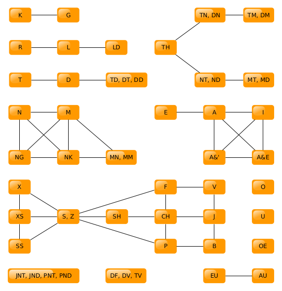

Similarity Resolution
#####################

When running a search, regular expressions are generated with alternatives
based on the given tokens. At a basic level, alternatives include
equivalent forms of the same token. When uncertainty is greater than 0,
similar tokens are also added as alternatives.

The similar tokens are defined by a similarity graph. The set of tokens
returned as being similar are all those within a distance equal to the
uncertainty from the target node when performing a breadth-first-search.

The similarity graph is shown below.

